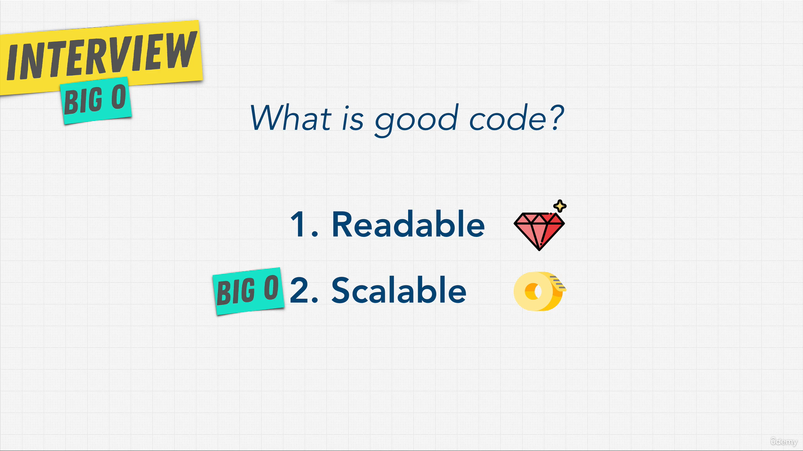
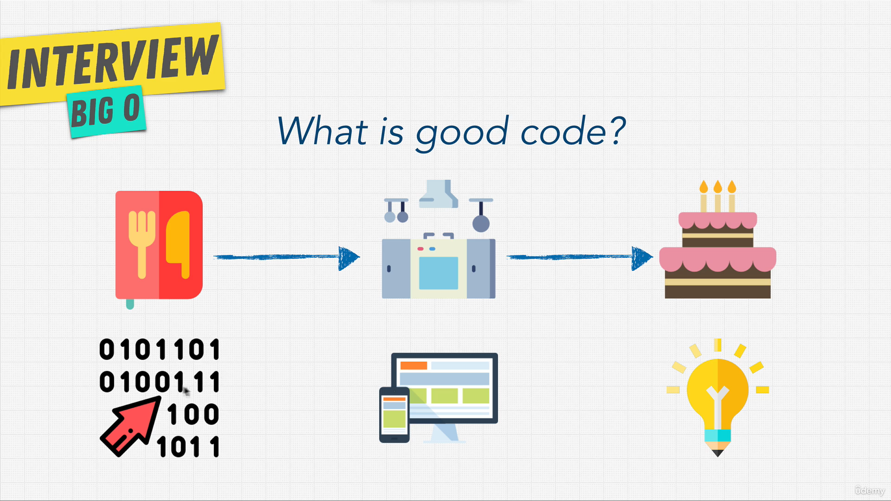
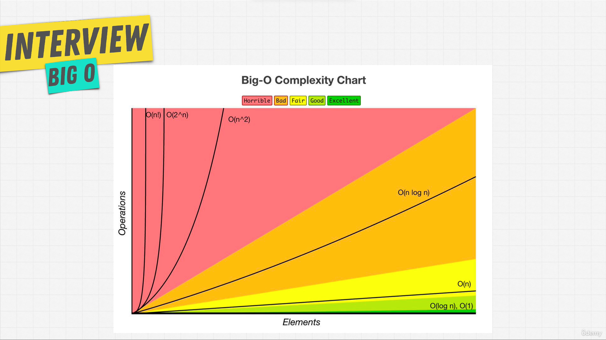

208. [Section Overview](#208)
209. [What Is Good Code?](#209)
210. [Big O and Scalability](#210)
211. [O(n)](#211)
212. [O(1)](#212)
213. [Exercise: Big O Calculation](#213)
214. [Solution: Big O Calculation](#214)
215. [Exercise: Big O Calculation 2](#215)
216. [Solution: Big O Calculation 2](#216)
217. [Simplifying Big O](#217)
218. [Big O Rule 1](#218)
219. [Big O Rule 2](#219)
220. [Big O Rule 3](#220)
221. [O(n^2)](#221)
222. [Big O Rule 4](#222)
223. [Big O Cheat Sheet](#223)
224. [What Does This All Mean?](#224)
225. [O(n!)](#225)
226. [3 Pillars Of Programming](#226)
227. [Space Complexity](#227)
228. [Exercise: Space Complexity](#228)
229. [Exercise: Twitter](#229)
230. [Section Summary](#230)

---

### 208. Section Overview<a id='208'></a>

### 209. What Is Good Code?<a id='209'></a>





- Find nemo replit [click me](https://replit.com/@aneagoie/findNemo1#main.js)

```js
//#1 -- For loop in Javascript.
const nemo = ["nemo"];

function findNemo1(array) {
  for (let i = 0; i < array.length; i++) {
    if (array[i] === "nemo") {
      console.log("Found NEMO!");
    }
  }
}

findNemo1(nemo);
```

### 210. Big O and Scalability<a id='210'></a>



- Find nemo replit more [click me](https://replit.com/@aneagoie/findingNemo2)

```js
//#1 -- For loop in Javascript.
const fish = ["dory", "bruce", "marlin", "nemo"];
const nemo = ["nemo"];
const everyone = [
  "dory",
  "bruce",
  "marlin",
  "nemo",
  "gill",
  "bloat",
  "nigel",
  "squirt",
  "darla",
  "hank",
];
const large = new Array(10).fill("nemo");

function findNemo2(fish) {
  let t0 = performance.now();
  for (let i = 0; i < fish.length; i++) {
    if (fish[i] === "nemo") {
      console.log("Found NEMO!");
    }
  }
  let t1 = performance.now();
  console.log("Call to find Nemo took " + (t1 - t0) + " milliseconds.");
}

findNemo2(everyone);
```

### 211. O(n)<a id='211'></a>

### 212. O(1)<a id='212'></a>

### 213. Exercise: Big O Calculation<a id='213'></a>

### 214. Solution: Big O Calculation<a id='214'></a>

### 215. Exercise: Big O Calculation 2<a id='215'></a>

### 216. Solution: Big O Calculation 2<a id='216'></a>

### 217. Simplifying Big O<a id='217'></a>

### 218. Big O Rule 1<a id='218'></a>

### 219. Big O Rule 2<a id='219'></a>

### 220. Big O Rule 3<a id='220'></a>

### 221. O(n^2)<a id='221'></a>

### 222. Big O Rule 4<a id='222'></a>

### 223. Big O Cheat Sheet<a id='223'></a>

### 224. What Does This All Mean?<a id='224'></a>

### 225. O(n!)<a id='225'></a>

### 226. 3 Pillars Of Programming<a id='226'></a>

### 227. Space Complexity<a id='227'></a>

### 228. Exercise: Space Complexity<a id='228'></a>

### 229. Exercise: Twitter<a id='229'></a>

### 230. Section Summary<a id='230'></a>
